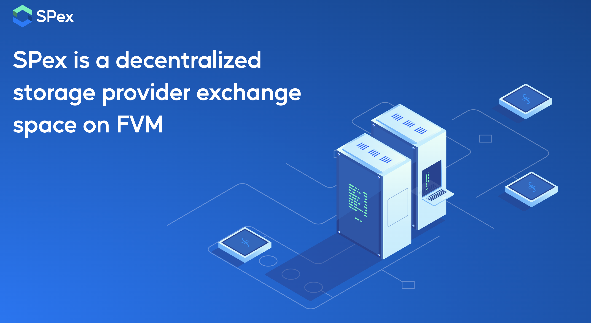
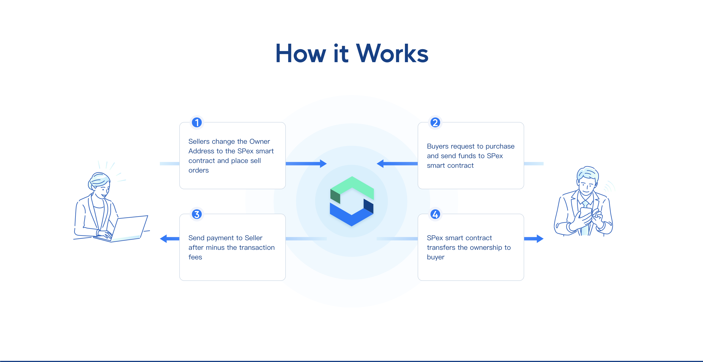

### Website
https://spex.website

### Docs
https://docs.spex.website

### Website Frontend
https://github.com/SPex-team/spex-front

### APP Frontend
https://github.com/SPex-team/AppDemo

### APP Backend
https://github.com/SPex-team/AppSpexBackend


### Interfaces
```solidity
/// @dev Validate if it’s the true owner of the Miner that sign. If yes, accept the Miner and transfer it into the contract and internally record that the Miner belongs to the current message sender.   
/// @param minerId Miner ID
/// @param sign Use the old owner adress to sign the content that the miner id already executed the Hex transformation. 
function confirmTransferMinerIntoSPex(bytes memory minerId, bytes memory sign) public

/// @dev Designate Miner & price and list the Miner on sale
/// @param minerId Miner ID
/// @param price Sale price
function listMiner(bytes memory minerId, uint256 price) public

/// @dev Edit the price of listed Miner
/// @param minerId Miner ID
/// @param newPrice New sale price
function changePrice(bytes memory minerId, uint256 newPrice) public

/// @dev Set the address that the owner want to transfer out of the contract to the outside ordinary address.
/// @param minerId Miner ID
/// @param newOwner New owner address
function transferOwnerOut(bytes memory minerId, bytes memory newOwner) public

/// @dev Cancel the listed on sale Miner order
/// @param minerId Miner ID
function cancelList(bytes memory minerId) public

/// @dev Buy the Miner, buyer pay for the price and target the buyer as new owner of the Miner in the contract and transfer the money to seller. 
/// @param minerId Miner ID
function buyMiner(bytes memory minerId) public payable

/// @dev Check owner info of the Miner via Miner ID
/// @param minerId Miner ID
function getOwnerById(bytes memory minerId) view public returns(address)

/// @dev check owner info of the listed Miner via Miner ID
/// @param minerId Miner ID
function getListMinerById(bytes memory minerId) view public returns(ListMiner memory)
```

### Eevents
```solidity
event EventMinerInContract(bytes minerId, address owner);
event EventList(bytes minerId, address seller, uint256 price);
event EventCancelList(bytes minerId);
event EventBuy(bytes minerId, address seller, uint256 price, address buyer);
event EventChangePrice(bytes minerId, uint256 newPrice);
event EventMinerOutContract(bytes minerId, bytes newOwner);
```